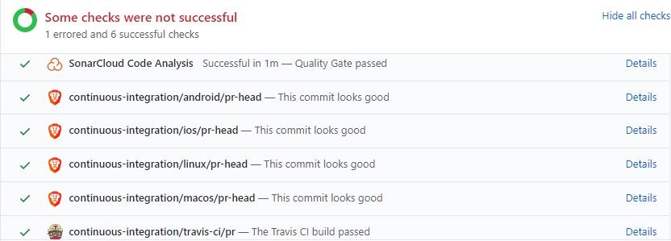

# PR Builder overview

Every PR in [brave-browser](https://github.com/brave/brave-browser) or [brave-core](https://github.com/brave/brave-core) needs to pass a series of automated checks before merging as described below.

## GitHub overview
On each PR, you should see the checks section as below (unless it's a draft PR or has the `CI/skip` label applied).

`Details` link will take you to the actual check results (Jenkins private, Travis publicly accessible).

### Helpful Jenkins links

When on a specific build from the build history there are some helpful links:
- `Console Output` - view full build output
- `Parameters` - view parameter values that have been passed to the build (as defined above)
- `Test Result` - view test results (unit and browser tests together)
- `Replay` - replay build (with option to alter pipeline)
- `Pipeline Steps` - best view for seeing the full list of steps and debugging (can view status and output of individual steps)
- `Workspaces` - view files in the build workspaces and nodes allocated to the build

### Start a PR builder Jenkins job

To build a PR on demand press on the `Build with Parameters` link from the Jenkins job view (`brave-browser-build-pr` or `brave-core-build-pr`). The following parameters are available:
- CHANNEL - `nightly` by default but can be `dev`, `beta` or `release` as well
- BUILD_TYPE - `Release` by default but can be `Debug` as well
- TERMINATE_NODE - `false` by default
- WIPE_WORKSPACE - `false` by default
- SKIP_INIT - `false` by default
- DISABLE_SCCACHE - `false` by default (only for Linux and macOS)
- SKIP_SIGNING - `true` by default
- DCHECK_ALWAYS_ON - `true` by default
- NODE_LABEL - empty by default - build node label where to execute
- SLACK_NOTIFY - empty by default - comma-separated list of Slack destinations to notify about build (`@mplesa,#build-bot` for example)

Same is valid for restarts, always do them from the top level jobs for proper status reporting.

## Jenkins overview
We have a private Jenkins server available at https://ci.brave.com (you need VPN and a Jenkins account). There are 13 pipelines at https://ci.brave.com/view/ci, per repo and per platform.

Each of these is setup in Jenkins as a multibranch pipeline. A scan is done every 5 minutes for new changes and (once detected) the job will automatically be queued up. Forks are ignored. When a new build starts it will cancel the previously running ones, unless it gets aborted for the following reasons:
- PR labeled with `CI/skip`
- PR is in draft

Extra skipping is available per platform using the `CI/skip-android`, `CI/skip-ios`, `CI/skip-linux`, `CI/skip-macos`, `CI/skip-windows` labels for PRs that do not need to run checks on all platforms.

Slack notifications will be sent to PR author based on a map that associates the GitHub user with their corresponding Slack username. To update, copy the value from our password manager, edit, then update in the Jenkins credential store `github-to-slack-username-map` variable. For extra notifications 

## Process overview
The checks that are done are defined in the Jenkinsfiles at https://github.com/brave/devops/blob/master/jenkins/jobs/browser/pr-brave-browser-*.Jenkinsfile

The above get called independently by both https://github.com/brave/brave-browser/blob/master/Jenkinsfile and https://github.com/brave/brave-core/blob/master/Jenkinsfile. After the build is done, it will look for a PR in the other repo and update its status.

To navigate to the top-level `brave-browser-build-pr-*` or the `brave-core-build-pr-*` pipeline please go to `Console Output` and press the link to `pr-brave-browser-...`. This will take you to where actually everything gets executed. Alternatively, the GitHub build links would take you there.

We use ephemeral nodes in AWS for building Android, Linux and Windows x64 (which get stopped after the build and reused at next one - unless TERMINATE_NODE is checked). For iOS and macOS builds we use physical machines (which means higher chance to re-use workspaces).

This Jenkinsfiles define the steps for building on Android `x86`, iOS `arm64`, Linux, macOS and Windowx `x64` with the steps below:
- notify the PR author (or extra destinations) on Slack that build has started
- checkout source code
- pin locally branch in `package.json` if branch also exists in `brave-core`
- install dependencies (`npm install --no-optional`) and remove `gclient` lock files
- test scripts (`npm run test:scripts`)
- initialize the repository (across runs we do `rm -rf src/brave` to force fetching the latest code then `npm run init`)
- audit dependencies (`npm run audit_deps`)
- run lint (`npm run lint`)
- enable `sccache`
- build
- gn check (`npm run gn_check`)
- audit network (`npm run network-audit`)
- unit tests and browser tests (`npm run test -- brave_unit_tests` and `npm run test -- brave_browser_tests`)
- create binaries (and optionally sign)
- upload build artifacts to S3 (`.apk`, `.zip`, `.dmg`, `.pkg`, `.deb`, `.rpm`, `.exe`)
- report build results and link to artifacts via Slack (to PR author and #build-downloads-bot)

Besides the platform builds, there are pipelines that do platform-agnostic pre-init or post-init checks like:
- JavaScript lint and unit tests
- Storybook tests
- security checks
- Python lint (pep8)

We also use [sonarcloud.io](https://sonarcloud.io) for code quality checks and [CodeQL](https://securitylab.github.com/tools/codeql) for security checks.

## Resources
- for employees, join the `#brave-browser-ci-guest` Slack channel
- for external contributors (community), we would like to have the content of these checks be publicly viewable in the future
- additional non-public information is available in the [devops wiki](https://github.com/brave/devops/wiki/PR-Builder-Non-public-information)
