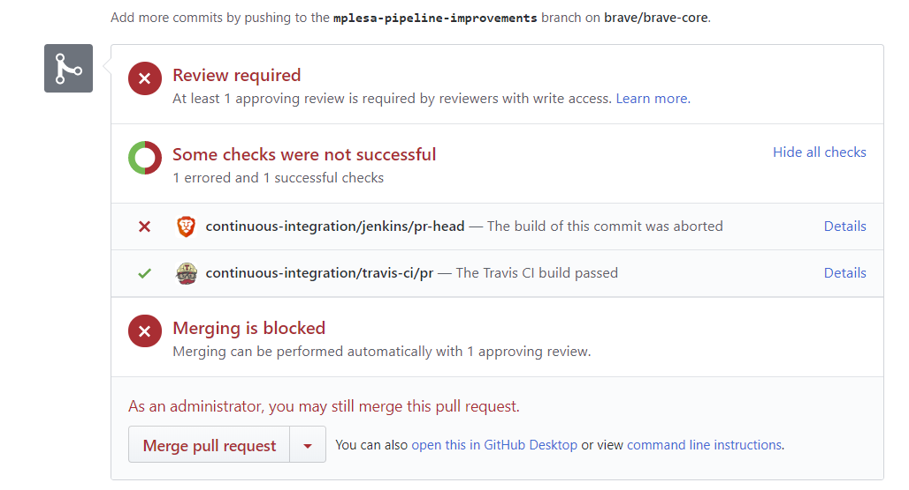
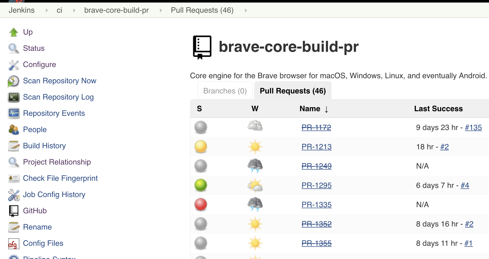

## Table of Contents
<!-- TOC -->

[Table of Contents](#table-of-contents)

[GitHub overview](#github-overview)

[Jenkins overview](#jenkins-overview)

[brave-browser checks](#brave-browser-checks)

[brave-core checks](#brave-core-checks)

[Questions?](#questions)

<!-- /TOC -->

Every PR in [brave-browser](https://github.com/brave/brave-browser) or [brave-core](https://github.com/brave/brave-core) needs to pass a series of automated checks before merging. The intention of this page is to describe those checks.

## GitHub overview
On each PR, you should see the checks section as below (unless it's a draft PR or has the `CI/Skip` label applied).

`Details` link will take you to the actual check results (Jenkins private, Travis publicly accessible).

## Jenkins overview
We have a private Jenkins server available at https://staging.ci.brave.com (behind VPN).

There are two jobs setup under the `ci` tab:
- brave-browser-build-pr
- brave-core-build-pr

Each of these is setup in Jenkins as a multibranch pipeline. A scan is done every 5 minutes for new changes and (once detected) the job will automatically be queued up.

Using the UI, you can go into either one of these and then view `Branches` and `Pull Requests`. You can see the history of checks by going into the specific PR or associated branch in Jenkins.

## brave-browser checks

The checks that are done are defined in the `Jenkinsfile` at the root of the project https://github.com/brave/brave-browser/blob/master/Jenkinsfile

This `Jenkinsfile` defines the pipeline that does:
- initialize the repository (`npm install --no-optional`, then `npm run init` if needed and finally `npm run sync -- --all`)
- run lint (`npm run lint`)
- build as an official build
- create distributables
- security checks (`npm run test-security`)
- unit tests and browser tests (`npm run test -- brave_unit_tests` and `npm run test -- brave_browser_tests`)
- upload build artifacts to S3 (`.dmg` file, `.deb` file, `.rpm` file, `.exe` files)

_**Note to reviewers**_: All checks should be passing before you merge a PR.

## brave-core checks

The checks here are executed by calling the `brave-browser` pipeline as defined in https://github.com/brave/brave-core/blob/master/Jenkinsfile

This `Jenkinsfile` defines the pipeline that does:
- create a new branch in `brave-browser` if it doesn't exist
- pin the `brave-core` branch in package.json from `brave-browser`
- if versions from `package.json` are different between the 2 repos then do a rebase on `brave-browser` against PR target branch
- waits for 6m for the new branch to be discovered by the `brave-browser` pipeline
- calls the `brave-browser` pipeline

Besides the checks done by our Jenkins job, there are some additional checks done via Travis:
- JavaScript lint and unit tests
- security checks
- Python lint (pep8)

_**Note to reviewers**_: All checks should be passing before you merge a PR.

## Questions?
- For employees, join the `#brave-core-ci` Slack channel and we'll be happy to answer questions.
    - Additional non-public information is available in the [devops wiki](https://github.com/brave/devops/wiki/PR-Builder-Non-public-information)
- Non-employees (community!), we would like to have the content of these checks be publicly viewable, but there aren't any plans to address that at the moment.
