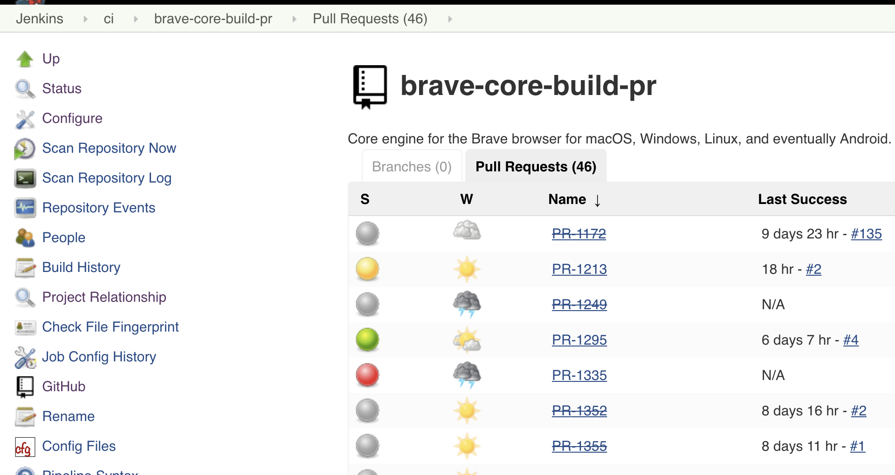
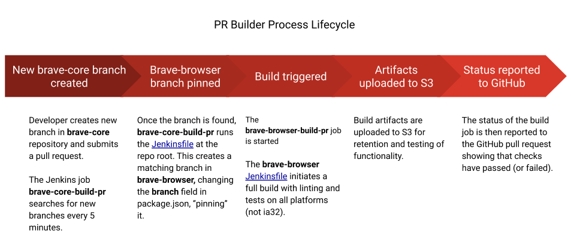

## Table of Contents
<!-- TOC -->

- [Table of Contents](#table-of-contents)
- [GitHub overview](#github-overview)
- [Jenkins overview](#jenkins-overview)
  - [PR Builder process lifecycle](#pr-builder-process-lifecycle)
  - [Helpful Jenkins links](#helpful-jenkins-links)
- [brave-browser checks](#brave-browser-checks)
- [brave-core checks](#brave-core-checks)
- [Advanced steps](#advanced-steps)
  - [Start a PR builder Jenkins job](#start-a-pr-builder-jenkins-job)
  - [Rebase a PR when failures occur](#rebase-a-pr-when-failures-occur)
- [Resources](#resources)

<!-- /TOC -->

Every PR in [brave-browser](https://github.com/brave/brave-browser) or [brave-core](https://github.com/brave/brave-core) needs to pass a series of automated checks before merging. The intention of this page is to describe those checks.

## GitHub overview
On each PR, you should see the checks section as below (unless it's a draft PR or has the `CI/skip` label applied).

`Details` link will take you to the actual check results (Jenkins private, Travis publicly accessible).

## Jenkins overview
We have a private Jenkins server available at https://staging.ci.brave.com (you need VPN and a Jenkins account).

There are two jobs setup under the `ci` tab:
- [brave-browser-build-pr](https://staging.ci.brave.com/view/ci/job/brave-browser-build-pr)
- [brave-core-build-pr](https://staging.ci.brave.com/view/ci/job/brave-core-build-pr)

Each of these is setup in Jenkins as a multibranch pipeline. A scan is done every 5 minutes for new changes and (once detected) the job will automatically be queued up. Forks are ignored. When a new build starts it will cancel the previously running ones, unless it gets aborted for the following reasons:
- `CI/skip` label present
- build started from `brave-browser` PR when a matching `brave-core` PR or branch exists (build should be started from there to correctly report status on both PRs)

Extra skipping is available per platform using the `CI/skip-android`, `CI/skip-ios`, `CI/skip-linux`, `CI/skip-macos`, `CI/skip-windows` labels. They are recommended just to save time and resources during development, before merge please take them out and re-run build (unless agreed otherwise with reviewer or uplift approvers).

Using the UI, you can go into either one of these and then view `Branches` and `Pull Requests`. You can see the history of checks by going into the specific PR or associated branch in Jenkins.

### PR Builder process lifecycle

The PR builder lifecycle has multiple steps that are described in this image:

### Helpful Jenkins links

When on a specific build from the build history there are some helpful links:
- `Console Output` - view full build output
- `Parameters` - view parameter values that have been passed to the build (as defined above)
- `Test Result` - view test results (unit and browser tests together)
- `Replay` - replay build (with option to alter pipeline)
- `Pipeline Steps` - best view for seeing the full list of steps and debugging (can view status and output of individual steps)
- `Workspaces` - view files in the build workspaces and nodes allocated to the build

## brave-browser checks
The checks that are done are defined in the `Jenkinsfile` at the root of the project https://github.com/brave/brave-browser/blob/master/Jenkinsfile.

This `Jenkinsfile` defines the pipeline that builds in parallel for Android `arm64`, iOS `arm` and `arm64`, Linux, macOS and Windowx `x64` with the steps below:
- checkout source code
- pin locally branch in `package.json` if branch also exists in `brave-core`
- install dependencies (`npm install --no-optional`) and remove `gclient` lock files
- initialize the repository (across runs we do `rm -rf src/brave` to force fetching the latest code then `npm run init`)
- run lint (`npm run lint`)
- audit dependencies (`npm run audit_deps`)
- enable `sccache`
- build
- audit network (`npm run network-audit`)
- unit tests and browser tests (`npm run test -- brave_unit_tests` and `npm run test -- brave_browser_tests`)
- create distributables
- upload build artifacts to S3 (`.apk`, `.dmg`, `.pkg`, `.deb`, `.rpm`, `.exe`)

We use ephemeral nodes in AWS for building Android, Linux and Windows x64 (which get shutdown if idle for 30m (if no other builds start on them). For macOS we use physical machines (which means higher chance to re-use workspaces).

## brave-core checks
The checks here are executed by calling the `brave-browser` pipeline as defined in https://github.com/brave/brave-core/blob/master/Jenkinsfile.

To navigate from the `brave-core` build to the `brave-browser` one please go to `Console Ouput` and press the link to it.

This `Jenkinsfile` defines the pipeline that does:
- create a new branch in `brave-browser` if it doesn't exist
- do a rebase on `brave-browser` against PR target branch (if versions in `package.json` are different across the 2 repos)
- push new branch
- wait for 6m for the new branch to be discovered by the `brave-browser` pipeline
- calls the `brave-browser` pipeline

Besides the checks done by our Jenkins job, there are some additional checks done via Travis:
- JavaScript lint and unit tests
- security checks
- Python lint (pep8)

## Advanced steps

### Start a PR builder Jenkins job

To build a PR on demand press on the `Build with Parameters` link from the Jenkins job view. The following parameters are available:
- CHANNEL - `nightly` by default but can be `dev`, `beta` or `release` as well
- BUILD_TYPE - `Release` by default but can be `Debug` as well
- WIPE_WORKSPACE - `false` by default
- SKIP_INIT - `false` by default
- DISABLE_SCCACHE - `false` by default (only on Android, Linux and macOS)
- SKIP_SIGNING - `true` by default
- DEBUG - `false` by default

## Resources
- for employees, join the `#brave-core-ci` Slack channel
- for external contributors (community), we would like to have the content of these checks be publicly viewable in the future
- additional non-public information is available in the [devops wiki](https://github.com/brave/devops/wiki/PR-Builder-Non-public-information)
